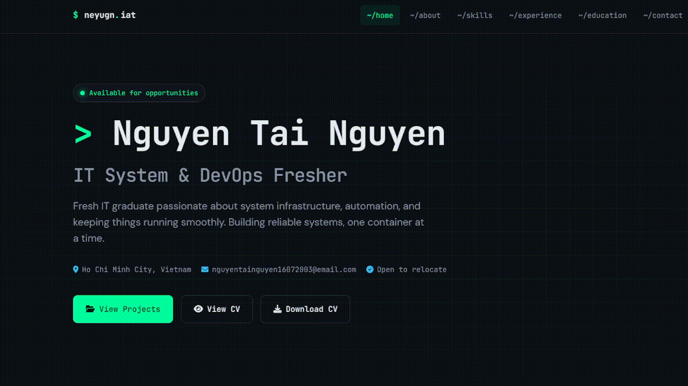
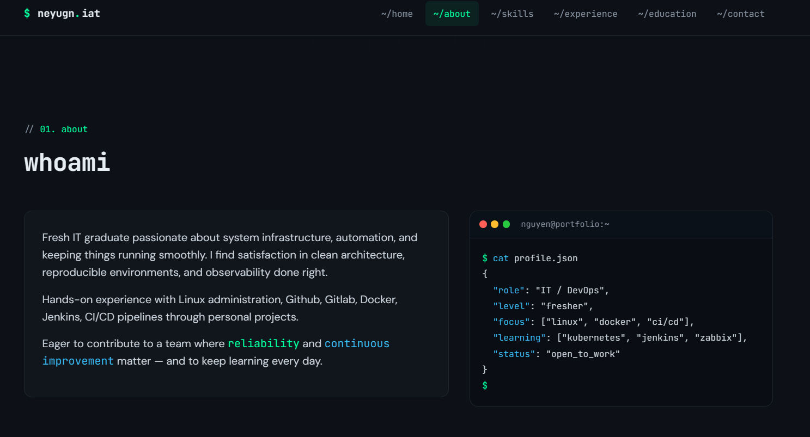

# Personal Portfolio Website

A modern dark-mode portfolio website for showcasing my IT System Administration, DevOps, and Infrastructure projects.

## 🚀 Live Demo

[Live Demo](https://neyugniat.vercel.app/)

## 🛠️ Tech Stack

- HTML5
- CSS3
- Vanilla JavaScript
- Font Awesome
- Responsive Design

## 📂 Featured Projects

### Security & Monitoring Homelab
- Prometheus + Grafana monitoring stack
- Wazuh SIEM setup
- pfSense Firewall & Suricata IDS/IPS
- Kali Linux attack simulations

### Dynamic VLAN with RADIUS
- Windows Server 2019
- AD DS, DHCP, NPS
- Dynamic VLAN assignment using RADIUS authentication

## ✨ Features

- Dark terminal-inspired UI
- Responsive layout
- Smooth scrolling
- Animated sections
- Downloadable CV
- Project blog links

## 📸 Preview

## 📬 Contact

- LinkedIn: https://www.linkedin.com/in/neyugniat16072003/
- GitHub: https://github.com/neyugniat

---

Built as part of my learning journey in IT Infrastructure, System Administration, and DevOps.
